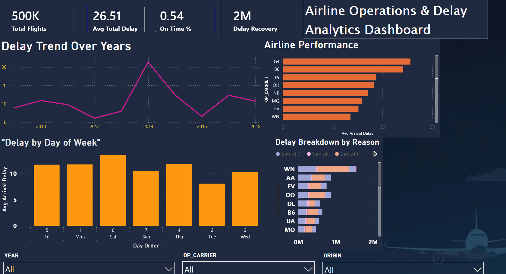

# ✈️ Airline Delay Intelligence Dashboard

## 📊 Project Overview

This project analyzes multi-year airline flight data to uncover delay patterns, airline performance, and key delay causes.
The goal is to provide actionable insights using data analytics and visualization.

---

## 🚀 Tech Stack

* Python (Pandas, Data Cleaning)
* MySQL (Data Storage)
* Power BI (Dashboard & Visualization)

---

## 📁 Dataset

* Multi-year airline dataset (2009–2018)
* Includes flight delays, routes, airlines, and delay reasons

---

## 📊 Key Features

* KPI Metrics (Total Flights, Avg Delay, On-Time %)
* Delay trend analysis over time
* Airline performance comparison
* Day-wise delay insights
* Delay cause breakdown (Weather, Carrier, NAS, etc.)
* Interactive filters (Year, Airline, Origin)

---

## 🔍 Key Insights

* Late aircraft and weather are major contributors to delays
* Certain airlines consistently perform better than others
* Delay patterns vary across days of the week

---

## 📸 Dashboard Preview

---

## 💼 Use Case

This project demonstrates:

* End-to-end data pipeline (Python → SQL → Power BI)
* Real-world data cleaning and transformation
* Business-oriented data storytelling

---

## 🧠 What I Learned

* Handling large datasets efficiently
* Creating interactive dashboards in Power BI
* Extracting business insights from raw data

---

## 📌 Future Improvements

* Add delay prediction using machine learning
* Integrate real-time flight API
* Enhance dashboard with drill-through analysis

---

## 🔗 Author

Pulkit Khaneja
